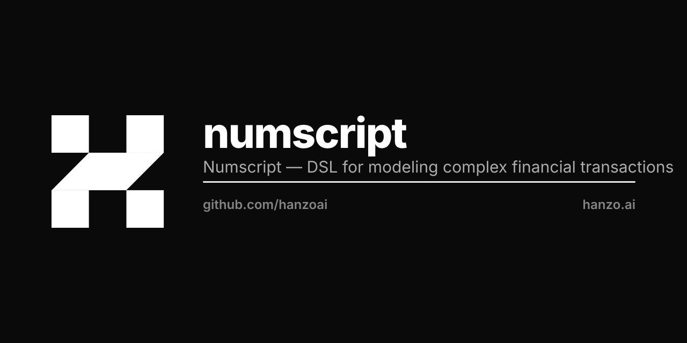

<p align="center"></p>

# Numscript

Domain-specific language for modeling financial transactions. Used by [Hanzo Ledger](https://github.com/hanzoai/ledger) for programmable money movement.

## Features

- **Declarative Transactions** — Express complex multi-party transfers in readable syntax
- **Percentage Splits** — Route funds to multiple destinations by percentage or fixed amount
- **Source Ordering** — Define fallback funding sources with automatic overdraft prevention
- **Variables** — Parameterize scripts for reuse across different amounts and accounts
- **Type Safety** — Compile-time validation of account references and asset types

## Examples

```numscript
// Simple transfer
send [USD/2 5000] (
  source = @users:alice
  destination = @users:bob
)

// Multi-source with fee split
send [USD/2 10000] (
  source = {
    @users:alice
    @users:alice:savings
  }
  destination = {
    85% to @merchants:shop
    10% to @platform:fees
    5%  to @platform:reserve
  }
)

// Parameterized script
vars {
  monetary $amount
  account $sender
  account $receiver
}
send $amount (
  source = $sender
  destination = $receiver
)
```

## Usage

```bash
# Install CLI
go install github.com/hanzoai/numscript/cmd/numscript@latest

# Parse and validate a script
numscript check script.num

# Format a script
numscript fmt script.num
```

## Go Library

```go
import "github.com/hanzoai/numscript"

program, err := numscript.Parse(`
  send [USD/2 1000] (
    source = @world
    destination = @users:001
  )
`)
```

## License

MIT — see [LICENSE](LICENSE)

